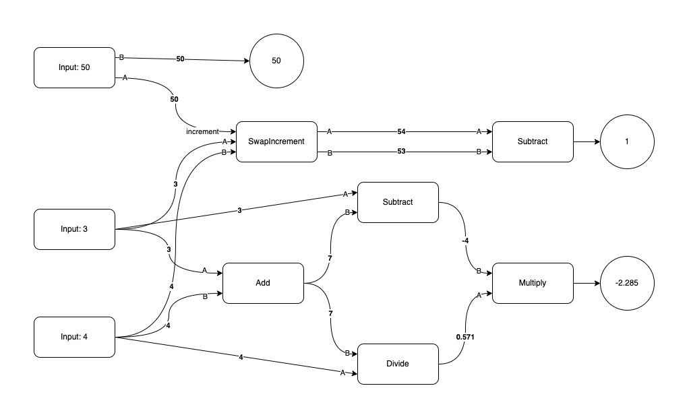

# Graph Execution Engine
Execute Python code, graph style!

## Why?
I was bored. So I decided to write this monstrosity. It's a graph execution engine. It's a way to execute Python code in a graph just like in node based software like Blender, Unreal Engine, etc. It's a fun project and I'm sure it's not useful for anything. But it's fun to write and fun to use.

## Installation
```bash
echo "It's not a package yet. Just clone the repo and run the main.py file."
```

## Usage
### JSON graph
The JSON file consists of two keys: `nodes` and `edges`. The `nodes` key contains a list of nodes. Each node is a dictionary with the following keys:
```json
{
    "id": "node-id",
    "type": "registered-function-name",
    "data": { // optional
        "value": 3 // input key words arguments
    }
}
```
The `edges` key contains a list of edges. Each edge is a dictionary with the following keys:
```json
{
    "id": "edge-id",
    "source": "source-node-id",
    "target": "target-node-id",
    "source_handle": "output", // optional, output of the source node if the source node has multiple outputs (dictionary)
    "target_handle": "input" // optional, input of the target node if the target node has multiple inputs
}
```
For more information, see the [graph.json](graph.json) file. The JSON file can be represented into this graph .
### Python code
1. Define some functions or callables.
```python
def input(value):
    return value


def add(a, b):
    return a + b


def subtract(a, b):
    return a - b


def multiply(a, b):
    return a * b


def divide(a, b):
    if b != 0:
        return a / b
    else:
        raise ValueError("Cannot divide by zero.")

class SwapIncrement:
    def __init__(self, increment):
        self.increment = increment

    def __call__(self, a, b):
        return {"a": b + self.increment, "b": a + self.increment}
```
2. Register your defined functions or callables.
```python
from gxe import NodeRegistry

node_registry = NodeRegistry()
node_registry.register(
  [
      input,
      add,
      subtract,
      multiply,
      divide,
      SwapIncrement,
  ]
)
```
3. Load the graph from a JSON file.
```python
import json

with open("graph.json", "r") as f:
    graph = json.load(f)
```
4. Create a graph execution engine.
```python
from gxe import GraphExecutionEngine

engine = GraphExecutionEngine(graph, node_registry)
engine.parse_node()
```
5. Run the graph.
```python
result = engine.execute()
```
6. Print the result.
```python
for node in result.values():
    print(node)
```
```
Node node-1 | Label: input | Inputs: {'value': 3} | Output: 3
Node node-2 | Label: input | Inputs: {'value': 4} | Output: 4
Node node-3 | Label: add | Inputs: {'a': 3, 'b': 4} | Output: 7
Node node-4 | Label: subtract | Inputs: {'a': 3, 'b': 7} | Output: -4
Node node-5 | Label: divide | Inputs: {'a': 4, 'b': 7} | Output: 0.5714285714285714
Node node-6 | Label: multiply | Inputs: {'b': 0.5714285714285714, 'a': -4} | Output: -2.2857142857142856
Node node-7 | Label: SwapIncrement | Inputs: {'a': 3, 'b': 4} | Output: {'a': 54, 'b': 53}
Node node-8 | Label: subtract | Inputs: {'a': 54, 'b': 53} | Output: 1
Node node-9 | Label: input | Inputs: {'value': {'a': 50, 'b': 50}} | Output: {'a': 50, 'b': 50}
```

## How it works?
Basically, you create a graph with nodes. Each node is a Python function (or callable if you want to be more general). You connect the nodes with edges. When you run the graph, it executes the nodes in order based on the nodes dependencies.

## License
Graph Execution Engine is licensed under Do What The Fuck You Want To Public License. See the [LICENSE](LICENSE) file for more information.
